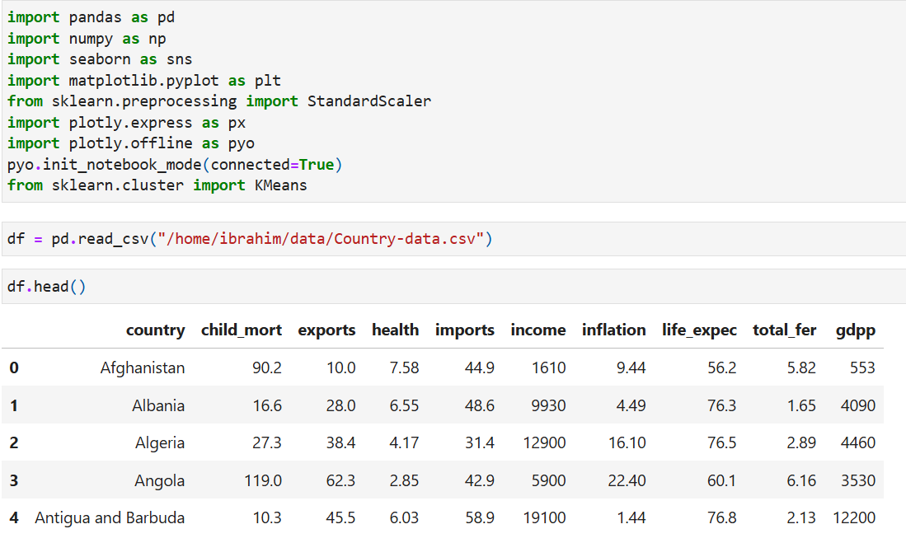
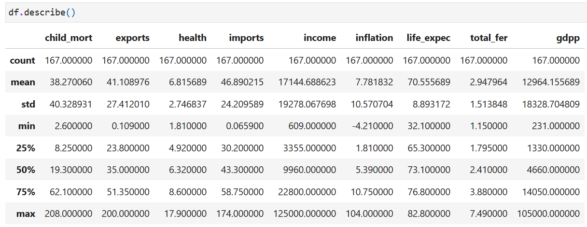
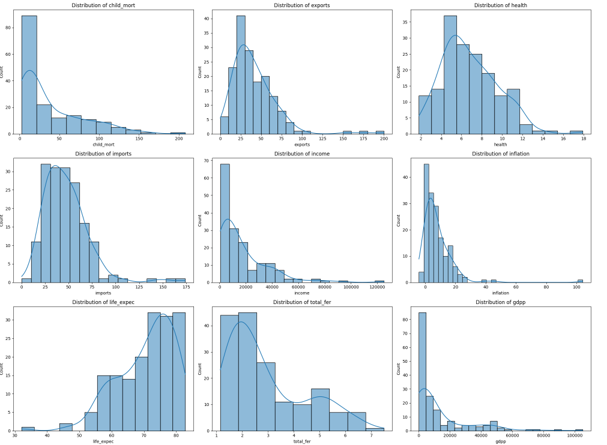
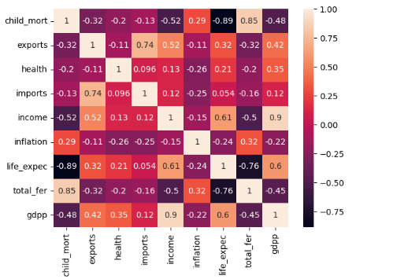
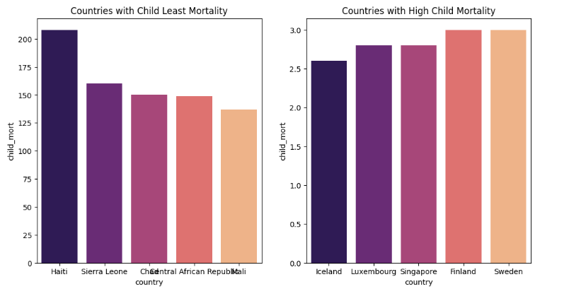
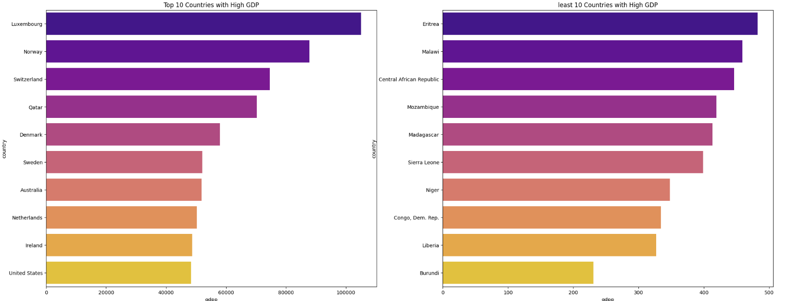
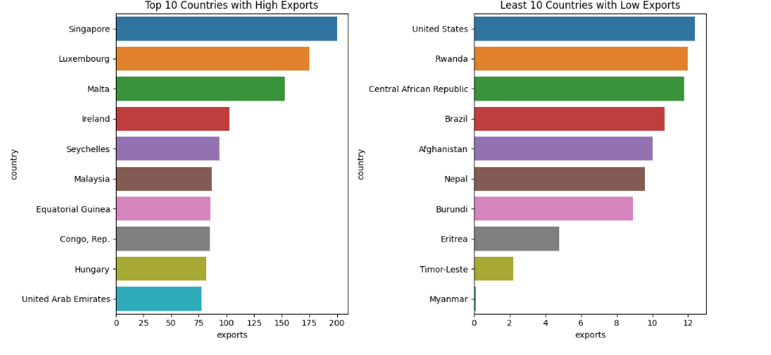
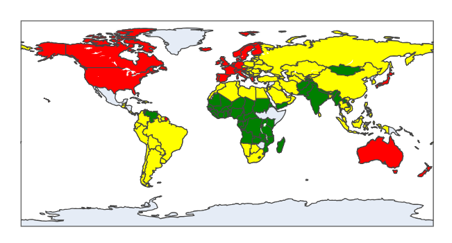

# Countries Clkustering-Analysis for Financial Aid

## Introduction
This case study focuses on clustering a dataset consisting of countries in regards to various social issues like health, inflation, child_morth, gdpp, life expectancy among others to effectively identify nations that require financial aid, prioritizing those with low GDP per capita and lower life expectancy.

**_Disclaimer_**: All datasets and reports does not represent any company, country or institution. They are just dummy datasets for practise purposes.

## Problem Statement
As requested by the NGO for proper disbursement of donations received in proportion to the needs of the country based on the features, the following problems statement subsists.
1. Group the countries optimally to identify countries with critical conditions
2. Explore countries in the groups to identify countries to prioritize when disbursing the donations.

## Skills and Concept demonstrated
- Python programming language
- pandas library
- seaborn library
- matplotlib library
- Scikit-learn
- K means clustering

# Visualization
## Importing Libraries and previewing first five(5) rows of the dataset

## Statistical Distribution of the dataset

The disparity in the data distribution as seen is as a result of the variation in the features based on individual countries. This is better explained in the correlation heatmap

## Distribution of Variables

1. Child mortality postively skewed showing that most countries have low child mortality rate
2. Export also rightly skewed depicting majority of countries have low export percentages. Few countries have high export percentages.
3. Distribution of health shows its moderately right-skewed. Most countries spend a moderate percentage on health.
4. Distribution of imports shows a right-skewed distribution showing that most countries have lower imports as a percentage of GDP. Only few countries have very high import levels.
5. Income has a strong right skew. This means most countries have low to moderate income. A small number of countries have extremely high income levels.
6. Inflation is positively skewed. Most countries have low inflation rate.
7. Life expectancy is close to a normal distribution with a slight left skew. This means majority of the countries have high life expectancy. Some countries have low life expectancy.
8. Total fertility distribution is biomodal as variation in fertility rate could be noticed among the countries.
9. GDP per capital has a strong positively skewed distribution showing that most countries have low GDP per capital.

## Features Correlation

## First and Last 5 countries with Mortality Rate

## Top and Last 10 Countries with GDP performamce

## Top and Last 10 Countries In Export

## SEgmentation

## Conclusion
Using the K means clustering model, the countries has been grouped into three categories,
1. Require Foreign Aid indicated with RED color
2. Do Not require Foreign Aid indicated with GREEN
3. Not a Priority indicated with YELLOW color

The interactive view of the map is in the notebook.  [here](https://github.com/lasibrahim/Segmentation-Analysis/commit/226a81b6c730f1cd7f9b5559228e39c28a5a4a43#diff-9379d91d6feaaf6b4cab3e0d8c7cd850a1285ae2f7d8297da5a627996d38bac7)
This grouping would make it easy for the NGO to easily and successfully disburse the donations among the countries base on the level of priority.

### Jupyter Notebook
[Segmentation Analysis on GitHub](https://github.com/lasibrahim/Segmentation-Analysis/blob/main/Unsupervised_learning.ipynb)

_Thank you for reading this far. Your comments and observations are welcome_. 

